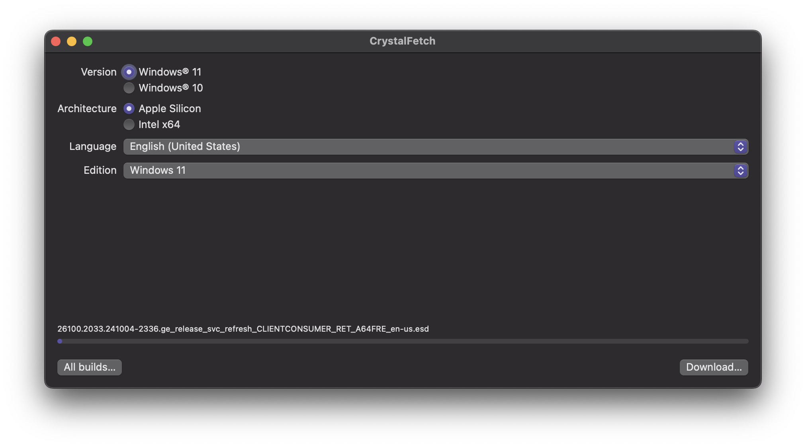
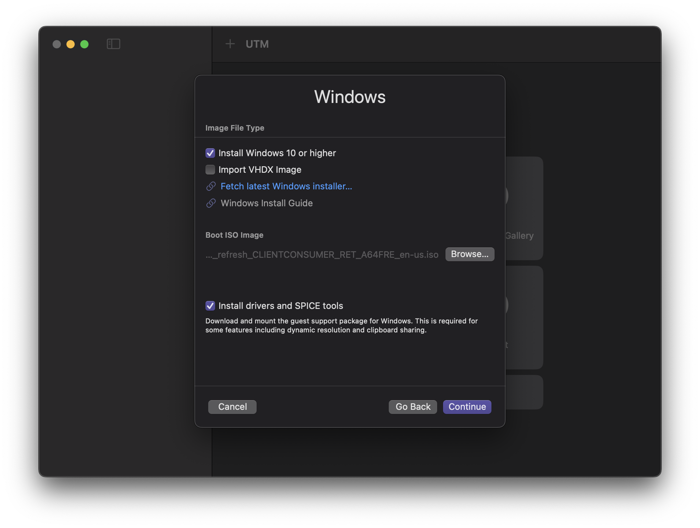
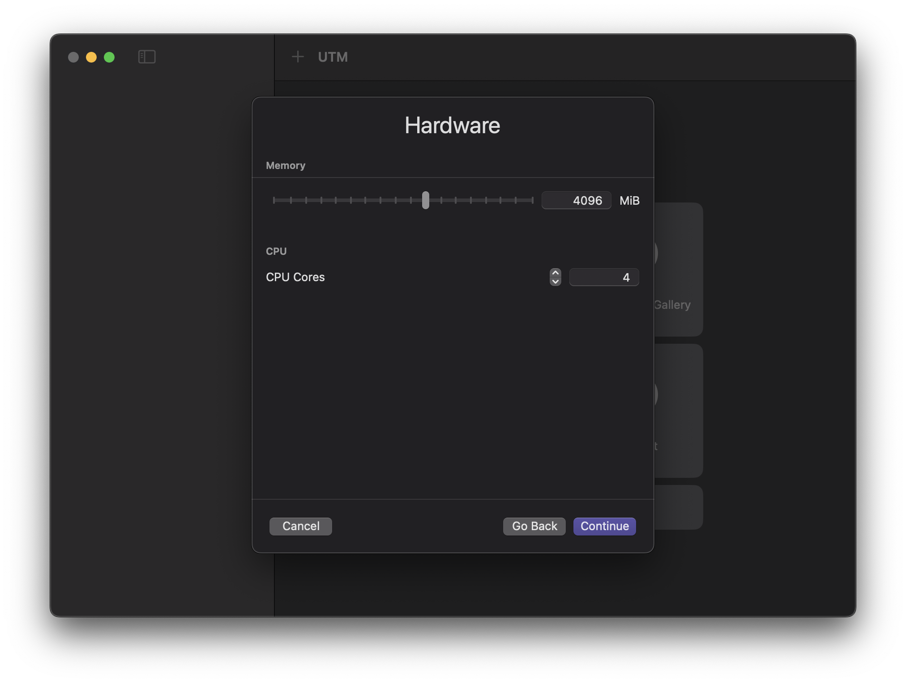

---
sidebar_position: 3
id: setup-vm
--- 

# Setting Up A Virtual Machine

## 1. Getting a Windows ISO

To install Windows on the virtual machine, you will need a Windows ISO file. You can skip this section if you already have a Windows ISO file.

1. Open the `CrystalFetch` app.
2. Select `Windows 11` from the list of versions (`Windows 10` should also work, but we recommend using `Windows 11`).
3. Select `Apple Silicon` from the list of architectures
4. Select any language you prefer, or leave it as default, which should be `English (United States)`
5. Press `Download...` to download the Windows ISO file
6. Select your preferred download location (your `Downloads` folder is probably the default and good enough) and press `Move`.
   

## 2. Creating the Virtual Machine

1. Open the `UTM` app.
   :::note
   When launching UTM for the first time, you may get a pop-up asking if you want to open it. Press `Open`. You may also get a "What's New" pop-up after it opens. Just press `Continue` to go to the next step.
   :::
2. Click on `Create New Virtual Machine`
3. Select `Virtualize` and click `Windows`
4. Make sure these settings are selected:
   - `Install Windows 10 or higher` is checked
   - `Import VHDX Image` is unchecked
   - `Install drivers and SPICE tools` is checked
   
5. Press `Browse...` and select the Windows ISO file you downloaded earlier, then press `Continue`.
6. Select the following settings:
   - `Memory`: `4096 MB` (4 GB) or more

      :::note
      We recommend setting the memory to 8 GB and the CPU cores to 8 if you have enough resources for it. A good rule of thumb is to allocate half of your system's RAM and CPU cores to the virtual machine.
      :::

   - `CPU Cores`: `4` or more

   
7. Press `Continue`. The default of 64GiB is fine for the disk size, but you can increase it if you want. Press `Continue` again.
8. If you wish to make a folder that is shared between macOS and your virtual machine, you can set it up here. Otherwise, press `Continue`.
9. Change the name of the virtual machine if you want, then press `Save`. Don't worry about the other settings.

## 3. Configuring the Virtual Machine

1. Click on the virtual machine you just created and press the configure button , which is next to the play button in the upper right corner.
2. Click on `Display` in the left sidebar.
3. Ensure `Resize display to window size automatically` is ticked.
4. Press `Save`.
5. Press `Command` + `,` to open UTM settings.
6. Click `Display` in the top bar.
7. Change the `Renderer Backend` to `ANGLE (Metal)`.
8. Close the settings window.

## 4. Installing Windows

:::important
If you see "Windows Guest Support Tools" under `Pending` in your sidebar, wait for it to finish installing before proceeding.
:::

1. Click on the virtual machine you created and press the play button in the upper right corner.
2. When the window pops up, spam any key on your keyboard to boot to the Windows installer.
3. Wait for the installer to load.
4. Follow the instructions to install Windows.
   - When asked for a product key, skip it by pressing `I don't have a product key`. We will activate Windows later.
   - Select `Windows 11 Pro` when asked which version to install.
   - When asked where to install Windows on, there should be only one option in the list. Select it and press `Next`.
5. Wait for Windows to install. This will take a while.
6. The installer will restart the virtual machine.

## 5. Going Through Windows Setup

Wait for the Windows setup screen to show up. Setting up Windows is quite straightforward. Just follow the instructions on the screen. However, there are a few things to note:

1. Windows may restart a few times during the setup process. This is normal. Do not spam any keys during these restarts.
2. If you get stuck on a screen with the UTM logo and a spinning circle after a restart, feel free to restart the virtual machine by closing the window and pressing the play button again.
